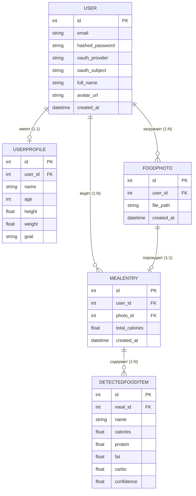
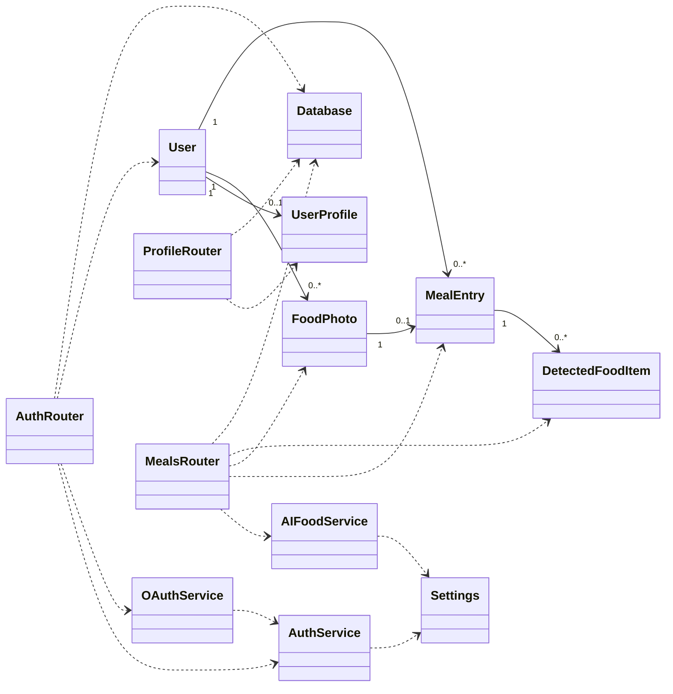

# Fit it Backend

FastAPI-бэкенд для трекера питания: авторизация (email/password + OAuth), профиль
пользователя, загрузка фото еды, распознавание блюд и КБЖУ через vision-модель
(OpenRouter) и дневник питания с подсчётом калорий за день и неделю.

## Стек

- **FastAPI** + **Uvicorn**
- **SQLModel** (SQLAlchemy + Pydantic) поверх **PostgreSQL**
- **JWT** (python-jose) и хеширование паролей (passlib + bcrypt)
- **Authlib** — OAuth-логин через Google, GitHub, Yandex
- **OpenAI SDK** через **OpenRouter** — распознавание еды по фото
- **Docker** / **docker compose**

## Возможности

- Регистрация и вход по email/password
- JWT bearer-авторизация, получение текущего пользователя, валидация токена
- OAuth-логин: Google, GitHub, Yandex
- Получение и редактирование профиля (имя, возраст, рост, вес, цель)
- Загрузка фото еды и распознавание блюд с оценкой КБЖУ
- Сохранение распознанного приёма пищи в базу
- Ручная корректировка результата распознавания
- Дневник питания за день
- Подсчёт калорий за день и за неделю
- Удаление записи о приёме пищи

## Быстрый запуск

```bash
cp .env.example .env
# заполнить JWT_SECRET_KEY, SESSION_SECRET_KEY,
# при необходимости OAuth-ключи и OPENROUTER_API_KEY
docker compose up --build
```

- API: `http://localhost:8000`
- Swagger UI: `http://localhost:8000/docs`
- ReDoc: `http://localhost:8000/redoc`

`docker compose` поднимает два контейнера: `db` (PostgreSQL 16) и `backend`.
Таблицы ��оздаются автоматически при старте приложения. Загруженные фото
монтируются в `./uploads`.

## Локальный запуск без Docker

Нужен запущенный PostgreSQL и заполненный `DATABASE_URL` в `.env`.

```bash
python -m venv .venv
source .venv/bin/activate          # Windows: .venv\Scripts\activate
pip install -r requirements.txt
uvicorn app.main:app --reload --port 8000
```

## Переменные окружения

| Переменная | Назначение |
|---|---|
| `DATABASE_URL` | Строка подключения к PostgreSQL (`postgresql+psycopg2://...`) |
| `JWT_SECRET_KEY` | Секрет для подписи JWT |
| `SESSION_SECRET_KEY` | Секрет для серверной сессии (нужен для OAuth-флоу) |
| `ACCESS_TOKEN_EXPIRE_MINUTES` | Время жизни токена, минут (по умолчанию 60) |
| `BACKEND_PUBLIC_URL` | Публичный URL бэкенда для генерации OAuth callback'ов |
| `FRONTEND_URL` | URL фронтенда (добавляется в CORS) |
| `FRONTEND_OAUTH_REDIRECT_URL` | Куда редиректить после OAuth (опционально, см. ниже) |
| `MOBILE_OAUTH_REDIRECT_URL` | Deep-link редиректа для мобильного OAuth (`?mobile=true`) |
| `GOOGLE_CLIENT_ID` / `GOOGLE_CLIENT_SECRET` | OAuth Google |
| `GITHUB_CLIENT_ID` / `GITHUB_CLIENT_SECRET` | OAuth GitHub |
| `YANDEX_CLIENT_ID` / `YANDEX_CLIENT_SECRET` | OAuth Yandex |
| `OPENROUTER_API_KEY` | Ключ OpenRouter для распознавания еды |
| `OPENROUTER_MODEL` | Vision-модель (по умолчанию `nvidia/nemotron-nano-12b-v2-vl:free`) |

Распознавание ед�� требует `OPENROUTER_API_KEY` — без него `POST /meals/photo`
вернёт ошибку.

## Авторизация

Все защищённые эндпоинты ожидают заголовок `Authorization: Bearer <access_token>`.
Токен выдаётся при регистрации/входе и через OAuth-callback.

### Auth endpoints

| Метод | Путь | Описание |
|---|---|---|
| `POST` | `/auth/register` | Регистрация по `{ email, password }` |
| `POST` | `/auth/login` | Вход по `{ email, password }`, возвращает токен |
| `GET` | `/auth/me` | Текущий пользователь |
| `GET` | `/auth/token/validate` | Проверка валидности токена |
| `GET` | `/auth/oauth/providers` | Список OAuth-провайдеров и их статус |
| `GET` | `/auth/oauth/{provider}/login` | Старт OAuth (`provider`: google / github / yandex) |
| `GET` | `/auth/oauth/{provider}/callback` | OAuth callback |

OAuth callback URL для настройки в провайдерах:

- Google: `{BACKEND_PUBLIC_URL}/auth/oauth/google/callback`
- GitHub: `{BACKEND_PUBLIC_URL}/auth/oauth/github/callback`
- Yandex: `{BACKEND_PUBLIC_URL}/auth/oauth/yandex/callback`

Если задан `FRONTEND_OAUTH_REDIRECT_URL`, после успешного OAuth бэкенд
перенаправит пользователя туда с query-параметрами `access_token` и `token_type`.
Если не задан — callback вернёт JSON с токеном. Для мобильного клиента используется
`?mobile=true` и `MOBILE_OAUTH_REDIRECT_URL`.

### Profile endpoints

| Метод | Путь | Описание |
|---|---|---|
| `GET` | `/profile/me` | Профиль текущего пользователя |
| `PATCH` | `/profile/me` | Обновить поля профиля (name, age, height, weight, goal) |

### Meals endpoints

| Метод | Путь | Описание |
|---|---|---|
| `POST` | `/meals/photo` | Загрузить фото еды, распознать блюда и КБЖУ, сохранить приём пищи |
| `GET` | `/meals/day` | Записи о приёмах пищи за сегодня |
| `GET` | `/meals/calories/day` | Сумма калорий и число приёмов за сегодня |
| `GET` | `/meals/calories/week` | Калории за неделю с разбивкой по дням |
| `PATCH` | `/meals/{meal_id}` | Ручная корректировка распознанного блюда |
| `DELETE` | `/meals/{meal_id}` | Удалить запись о приёме пищи |

`POST /meals/photo` принимает `multipart/form-data` с файлом изображения.

## Структура базы данных

СУБД — **PostgreSQL**, доступ через ORM **SQLModel** (SQLAlchemy + Pydantic).
Таблицы создаются автоматически из моделей при старте приложения
(`SQLModel.metadata.create_all`). Всего 5 таблиц.

### `user` — пользователи

Учётные записи (как с паролем, так и созданные через OAuth).

| Поле | Тип | Описание |
|------|-----|----------|
| `id` | int, PK | Уникальный идентификатор пользователя |
| `email` | str, unique, index | Электронная почта (логин) |
| `hashed_password` | str, nullable | Хэш пароля (bcrypt); пустой у OAuth-пользователей |
| `oauth_provider` | str, nullable, index | Провайдер входа: `google` / `github` / `yandex` |
| `oauth_subject` | str, nullable, index | ID пользователя в системе провайдера OAuth |
| `full_name` | str, nullable | Полное имя |
| `avatar_url` | str, nullable | Ссылка на аватар |
| `created_at` | datetime | Дата и время регистрации |

### `userprofile` — анкета (физические данные), связь 1:1 с `user`

| Поле | Тип | Описание |
|------|-----|----------|
| `id` | int, PK | Идентификатор профиля |
| `user_id` | int, FK → `user.id`, unique | Владелец профиля |
| `name` | str, nullable | Имя для отображения |
| `age` | int, nullable | Возраст (лет) |
| `height` | float, nullable | Рост (см) |
| `weight` | float, nullable | Вес (кг) |
| `goal` | str, nullable | Цель (похудение / набор массы / поддержание) |

### `foodphoto` — загруженные фото еды

| Поле | Тип | Описание |
|------|-----|----------|
| `id` | int, PK | Идентификатор фото |
| `user_id` | int, FK → `user.id` | Кто загрузил фото |
| `file_path` | str | Путь к файлу на диске (папка `uploads/`) |
| `created_at` | datetime | Время загрузки |

### `mealentry` — приём пищи

Один приём пищи = одно распознанное фото с итоговой калорийностью.

| Поле | Тип | Описание |
|------|-----|----------|
| `id` | int, PK | Идентификатор приёма пищи |
| `user_id` | int, FK → `user.id` | Владелец записи |
| `photo_id` | int, FK → `foodphoto.id`, nullable | Связанное фото |
| `total_calories` | float | Суммарная калорийность приёма пищи |
| `created_at` | datetime | Время приёма пищи |

### `detectedfooditem` — распознанные продукты, связь 1:N с `mealentry`

| Поле | Тип | Описание |
|------|-----|----------|
| `id` | int, PK | Идентификатор продукта |
| `meal_id` | int, FK → `mealentry.id` | К какому приёму пищи относится |
| `name` | str | Название блюда |
| `calories` | float | Калорийность (ккал) |
| `protein` | float | Белки (г) |
| `fat` | float | Жиры (г) |
| `carbs` | float | Углеводы (г) |
| `confidence` | float (0..1) | Уверенность модели в распознавании |

### Связи между таблицами (ER-диаграмма)



## Основные классы и их взаимосвязь

Слоистая архитектура: модели (БД) → схемы (валидация) → сервисы (бизнес-логика)
→ роутеры (HTTP-эндпоинты).

### Модели-сущности (ORM, таблицы БД)

Наследуются от `SQLModel` (`app/models/`):

- **`User`** (`models/user.py`) — пользователь.
- **`UserProfile`** (`models/profile.py`) — анкета пользователя.
- **`FoodPhoto`**, **`MealEntry`**, **`DetectedFoodItem`** (`models/meal.py`) —
  фото, приём пищи и распознанные продукты.

### Классы-схемы (DTO, валидация запросов/ответов)

Наследуются от `pydantic.BaseModel`, не хранятся в БД (`app/schemas/`):

- **Auth**: `UserRegister`, `UserLogin`, `UserRead`, `Token`,
  `TokenValidateResponse`, `OAuthProviderRead`, `Message`.
- **Profile**: `ProfileRead`, `ProfileUpdate`.
- **Meal**: `FoodItemRead`, `MealPhotoResponse`, `MealRead`, `MealCorrection`,
  `CaloriesDayResponse`, `CaloriesWeekResponse`, `DailyCaloriesItem`.

### Сервисы (бизнес-логика, `app/services/`)

- **`auth_service`** — хэширование паролей (bcrypt), создание/проверка JWT
  (`create_access_token`, `decode_access_token`, `hash_password`, `verify_password`).
- **`oauth_service`** — вход через внешних провайдеров (Authlib `OAuth`):
  настройка клиентов, получение профиля, поиск/создание пользователя
  (`get_or_create_oauth_user`).
- **`ai_food_service`** — распознавание еды по фото: отправка изображения в
  vision-модель через OpenRouter и парсинг JSON с КБЖУ (`recognize_food_from_photo`).

### Роутеры (HTTP-слой, `app/routers/`)

Объекты `APIRouter`, подключаются в `main.py`:

- **`auth_router`** (`/auth`) — регистрация, вход, OAuth, `/me`, валидация токена.
  Содержит зависимость `get_current_user` — извлекает пользователя из JWT.
- **`profile_router`** (`/profile`) — чтение и обновление анкеты.
- **`meals_router`** (`/meals`) — загрузка фото, распознавание, статистика калорий,
  корректировка и удаление приёмов пищи.

### Инфраструктурные классы

- **`Settings`** (`config.py`) — конфигурация из переменных окружения.
- **`engine` / `get_session`** (`database.py`) — подключение к БД и выдача сессий.
- **`FastAPI app`** (`main.py`) — корневой объект приложения (CORS, сессии, роутеры).

### Диаграмма классов (UML)



## Структура проекта

```
app/
├── main.py             # точка входа FastAPI, CORS, middleware, роутеры
├── config.py           # настройки из переменных окружения
├── database.py         # engine и сессии SQLModel
├── models/             # ORM-модели: User, UserProfile, FoodPhoto, MealEntry, DetectedFoodItem
├── schemas/            # Pydantic-схемы запросов/ответов
├── routers/            # auth, profile, meals
└── services/           # auth, oauth, ai_food_service (OpenRouter)
uploads/                # загруженные фото еды
docker-compose.yml
Dockerfile
requirements.txt
```

## Дополнительно

Подробное описание API для фронтенда — в [`FRONTEND_API.md`](FRONTEND_API.md).
